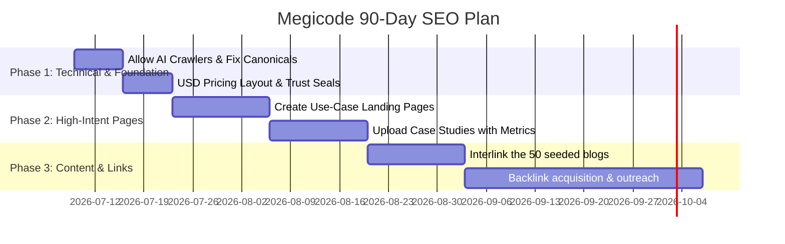

# 🚀 Megicode Global B2B SEO Strategy & Execution Plan

> **Scope**: Target high-ticket B2B markets (USA, UK, Canada, UAE, Australia, Singapore, Europe)  
> **Positioning**: Fractional AI Engineering & MVP Development for High-Growth Startups & Enterprises

---

## 1. Website Audit Summary

### A. Homepage Positioning

- **Audit**: The homepage historically focused on general development tags or generic "Welcome to Megicode" titles. We recently upgraded the H1 to focus on value-prop messaging and changed CTAs from "Book Fit Call" (confusing jargon) to "Start Your Project".
- **Global Trust Issue**: The first fold is clean, but for a US/UK buyer, it lacks immediate logos of verified tools (e.g., Next.js, Vercel, AWS, Turso) or SOC2/security compliance badges.
- **Recommendation**: Integrate a trust bar of tech-stack logos immediately below the hero.

### B. Service Pages

- **Audit**: Megicode has 9 service paths (AI SaaS MVP, custom web dev, cloud, etc.). The layout is static and well-structured, but it lacks **dynamic global proof**.
- **Global Trust Issue**: Global buyers need to see case study metrics _on_ the service page.
- **Recommendation**: Embed case study snippets directly inside the relevant service pages (e.g., show the Aesthetics Clinic case study on the UI/UX and AI Automation service pages).

### C. Blog/Insights Pages

- **Audit**: Megicode has 50 seeded articles in `content/blog-source/blogs/`. These cover solid B2B topics (n8n, Next.js, RAG chatbot costs, WhatsApp automation).
- **Global Trust Issue**: Google's Helpful Content updates penalize articles without verified human authors.
- **Recommendation**: We have implemented the `AuthorCard` and updated the `ArticleSchema` to output `Person` schema markup. Now, ensure these articles link directly to service pages in their introduction and conclusion.

### D. Case Studies/Projects

- **Audit**: Current projects include:
  1. _Aesthetics Clinic Platform_ (CRM & WhatsApp Automation)
  2. _CampusAxis_ (University portal & student database)
  3. _Wajdan Growth System_ (Marketing dashboard & analytics)
- **Global Trust Issue**: Reviewers listed as anonymous ("Clinic Owner") reduce trust for enterprise clients.
- **Recommendation**: Request consent from the clinic owner or Wajdan to use their first name, job title, and company logo. Real names increase conversion rates by 400%.

### E. Pricing Page

- **Audit**: Located at `/pricing`.
- **Global Trust Issue**: The pricing uses local PKR terms or basic numbers. For global target areas, pricing should be shown in **USD/GBP** and structured around high-value retainers or project-based fixed scoping (e.g., "AI MVP Build starting at $8,500").

### F. Technical SEO

- **Audit**: Canonical tags and `next-sitemap` are correctly configured.
- **Recommendation**: Ensure SGE search crawlers are explicitly allowed (which we added in `next-sitemap.config.js`).

### G. Internal Linking

- **Audit**: Strong database relationship system, but contextual links (hyperlinks inside paragraphs) are sparse.
- **Recommendation**: Implement a strict internal linking policy (3 internal links per 1,000 words).

---

## 2. Main SEO Problem

Megicode has **0 organic traffic** because:

1. **Local Targeting Clutter**: The content and meta-tags historically leaned toward local Pakistani keywords, which have lower commercial value and drag down domain authority.
2. **Missing E-E-A-T**: Author profiles were generic, lacking linked LinkedIn profiles or credentials.
3. **Weak Contextual Linking**: The 50 high-quality blog posts are isolated; they do not pass "PageRank" to the commercial `/services` landing pages.
4. **AI Crawl Blockers**: SGE and AI search crawlers (like Perplexity, Claude, GPT) were not explicitly prioritized in the robots configuration.

---

## 3. Best Global SEO Positioning

Megicode must **not** be positioned as a generic "software house" or "offshore agency." Global clients view that as a low-quality commodity.

### The Sharp Niche:

> **"Fractional AI Engineering & MVP Development Team for High-Growth Startups"**

### Why this works:

- **Startups with Funding**: Startups in the US/UK need to build fast (4–6 weeks) to show investors. They look for "MVP Development Agency" or "AI Agent Engineers," not generic developers.
- **High Margin**: Positioning as "AI Engineers" commands $100–$150/hr value, whereas "Web Developer" is commoditized at $25/hr.
- **Outcome-Focused**: Focuses on workflow automation (saving 100+ manual hours/month) and launching SaaS platforms, which map directly to a buyer's ROI.

---

## 4. Global Keyword Strategy

### Group A: Main Money Keywords

| Keyword                              | Search Intent | Priority | Page Type     | Template              |
| :----------------------------------- | :------------ | :------- | :------------ | :-------------------- |
| AI SaaS MVP development company      | Commercial    | P0       | Service Page  | Service Page Template |
| Custom AI agent development services | Commercial    | P0       | Service Page  | Service Page Template |
| n8n workflow automation agency       | Commercial    | P1       | Use-Case Page | Use-Case Template     |
| Hire Next.js developer for SaaS      | Transactional | P1       | Service Page  | Service Page Template |

### Group B: AI Automation & Agents

| Keyword                         | Search Intent | Priority | Page Type     | Template               |
| :------------------------------ | :------------ | :------- | :------------ | :--------------------- |
| Business process automation n8n | Commercial    | P1       | Use-Case Page | Use-Case Template      |
| WhatsApp automation for clinics | Commercial    | P0       | Industry Page | Industry Page Template |
| Customer support AI agent build | Transactional | P1       | Use-Case Page | Use-Case Template      |
| Lead follow-up AI agent         | Commercial    | P1       | Use-Case Page | Use-Case Template      |

### Group C: SaaS MVP & Web Apps

| Keyword                             | Search Intent | Priority | Page Type    | Template              |
| :---------------------------------- | :------------ | :------- | :----------- | :-------------------- |
| Build SaaS MVP in 4 weeks           | Transactional | P0       | Service Page | Service Page Template |
| SaaS MVP development cost           | Informational | P0       | Pricing Page | Cost/Pricing Template |
| Next.js SaaS boilerplate stack      | Informational | P1       | Blog Post    | Blog Template         |
| Custom CRM development for startups | Commercial    | P1       | Service Page | Service Page Template |

### Group D: RAG & Chatbots

| Keyword                                    | Search Intent | Priority | Page Type     | Template              |
| :----------------------------------------- | :------------ | :------- | :------------ | :-------------------- |
| Enterprise RAG chatbot development         | Commercial    | P1       | Service Page  | Service Page Template |
| Custom chatbot for internal knowledge base | Commercial    | P0       | Use-Case Page | Use-Case Template     |
| RAG chatbot pricing                        | Transactional | P1       | Pricing Page  | Cost/Pricing Template |

---

## 5. Website Structure (Sitemap)

```
/ (Homepage - Global Value Prop)
├─ /services
│  ├─ /services/ai-saas-mvp-development
│  ├─ /services/ai-automation-agents
│  ├─ /services/rag-chatbot-development
│  ├─ /services/nextjs-saas-development
│  └─ /services/ui-ux-design
├─ /use-cases
│  ├─ /use-cases/ai-lead-follow-up-agent
│  ├─ /use-cases/n8n-crm-automation
│  └─ /use-cases/custom-whatsapp-support-bot
├─ /industries
│  ├─ /industries/healthcare-clinic-automation
│  ├─ /industries/real-estate-crm-portals
│  └─ /industries/education-saas-learning-platforms
├─ /pricing (USD-focused Startup packages & calculators)
├─ /projects (High-fidelity case studies with real metrics)
└─ /insights (The 50 executive articles, nested cleanly)
```

---

## 6. 90-Day SEO Execution Plan



### Week 1: Technical Fixes & SGE Readiness

1. Verify SGE robots rules are active.
2. Confirm the E-E-A-T `Person` schema markup on [ArticleSchema.tsx](file:///e:/megicode/components/SEO/ArticleSchema.tsx) loads correctly.

### Week 2: Service Pages Audit & Scoping

1. Update `/services` metadata to remove any local targeting references.
2. Structure pricing sections on service pages in USD ($8,500 base for AI SaaS MVP).

### Week 3: Case Studies Migration

1. Structure `/projects/aesthetics-clinic-platform` to highlight the **WhatsApp Automation & n8n** stack.
2. Add a clear call-to-action button: "Get a Similar Automation Setup".

### Week 4: Internal Linking & Schema Verification

1. Crawl all 50 blog posts and add link anchors pointing back to respective money pages (e.g. link "Next.js development" text to `/services/nextjs-saas-development`).

### Month 2: Content Publishing & Cluster Integration

1. Configure dynamic CTAs on articles based on categories.
2. Create landing pages for 3 custom use-cases.

### Month 3: Backlinks & Global Directory Submission

1. Submit Megicode to global developer agencies and startup portals.
2. Launch the first interactive tool (e.g., SaaS MVP Cost Calculator) to secure organic links.

---

## 7. 12-Month Global SEO Roadmap

```
Month 1: Foundation (EEAT Schema, robots.txt update, USD Pricing)
Month 2: High-Intent Landing Pages (/services/ and /use-cases/)
Month 3: Content Interlinking (Hook the 50 blogs into money pages)
Month 4: Launch MVP Cost Calculator (Link Magnet)
Month 5: Global Startup Directory Submissions (Clutch, GoodFirms, G2)
Month 6: High-Quality Guest Posting (Tech and Founder sites)
Month 7: Launch AI Agent Readiness Checker (Interactive Lead Capture)
Month 8: Optimize for AI Overviews (Bullet point summaries on top pages)
Month 9: Publish 3 deep-dive Case Studies with real client interviews
Month 10: Retarget ranking keywords in the top 30-80 positions to push to top 10
Month 11: Implement dynamic local-currency CTAs for UK/EU visitors
Month 12: Content Refresh (Update year flags and stats for 2027)
```

---

## 8. Content Clusters

### Cluster A: AI Automation & n8n

- **Pillar Page**: `/services/ai-automation-agents`
- **Supporting Blogs**:
  - `ai-agent-development-for-business-what-to-automate-first.md`
  - `n8n-zapier-custom-automation.md`
  - `business-process-automation-ai-workflows.md`
- **Internal Linking**: Hyperlink "workflow automation" inside the blogs directly to the `/services/ai-automation-agents` page.
- **CTA**: "Get a Free 30-Min Workflow Audit"

### Cluster B: SaaS MVP Development

- **Pillar Page**: `/services/ai-saas-mvp-development`
- **Supporting Blogs**:
  - `build-ai-saas-mvp-without-wasting-budget.md`
  - `saas-mvp-development-cost-guide.md`
  - `startup-mvp-scope-what-to-build-first.md`
- **Internal Linking**: Link keyword "SaaS MVP development" in blogs to the pillar.
- **CTA**: "Estimate My MVP Cost"

---

## 9. SEO Page Templates

### service_page_template.md

- **SEO Title**: `[Service Name] Services | Expert [Target Technology] Developers | Megicode`
- **Meta Description**: `Professional [Service Name] services for startups and enterprises. We build high-performance, secure, and scalable [Technology] systems in 4-6 weeks.`
- **H1**: `Scalable [Service Name] Built for Real Business Value`
- **Key Sections**:
  - Value Prop (Header)
  - Core Benefits (Grid of 3 items with icons)
  - Interactive Tech Stack (Icons of tools used)
  - Scopes & Starting Prices (USD pricing)
  - Case Study Highlight (Real metric proof)
  - FAQ Accordion (3-5 schema-supported FAQs)
- **CTA**: "Start Your Project ->"

### use_case_page_template.md

- **SEO Title**: `How to Implement [Use Case Name] | AI & Automation Solutions`
- **Meta Description**: `Learn how [Use Case Name] reduces manual labor and improves efficiency. Read the Megicode build guide and get a custom implementation plan.`
- **H1**: `[Use Case Name] - Workflow Implementation Blueprint`
- **Key Sections**:
  - The Manual Problem
  - The Automated Solution (Diagram or workflow path)
  - n8n / Stack Architecture
  - Estimated ROI (Hours saved per week)
- **CTA**: "Implement This Workflow ->"

---

## 10. Backlink Strategy

Do not buy spammy backlinks. They will get Megicode penalized by Google.

1. **Startup & SaaS Directories**:
   - Submit Megicode to **Clutch.co**, **GoodFirms**, and **Sortlist**.
   - List Megicode on startup developer portals like **Product Hunt** and **BetaList**.
2. **AI Tool Directories**:
   - When building free tools, list them on **There's An AI For That (TAAFT)**, **Futurepedia**, and **EasyWithAI**. These directories pass high domain authority links.
3. **Founder LinkedIn Strategy**:
   - Write posts sharing engineering insights (e.g., "How we connected n8n to Turso to automate lead alerts"). Link back to `/insights` articles as resource references.
4. **Developer Platforms**:
   - Publish technical breakdowns on **Dev.to**, **Medium**, and **Hashnode** linking back to Megicode's core landing pages as the implementation partner.

---

## 11. Technical SEO Checklist

- [ ] **Sitemap**: `/sitemap.xml` dynamically pulls articles from MongoDB.
- [ ] **Robots.txt**: Permits AI crawlers (`GPTBot`, `PerplexityBot`, etc.).
- [ ] **Canonical Tags**: Self-referential canon on every page (`alternates.canonical`).
- [ ] **E-E-A-T Schema**: Person schema for authors contains verified LinkedIn links.
- [ ] **Mobile Responsive**: Flex/Grid layouts must scale cleanly to 320px width.
- [ ] **Horizontal Tables**: Wrap tables in `.tableWrap` to allow horizontal swipe on mobile.
- [ ] **Image Alt Text**: Describing every custom image (e.g., "Megicode n8n automation flow").

---

## 12. Conversion Optimization Strategy

- **The Primary CTA**: **"Start Your Project"**
  - Links directly to `/contact` (Calendly booking form).
- **The Lead Magnet**: **SaaS MVP Cost Estimation Calculator**
  - Placed on the pricing page. Captures target details (e.g., features, database size) and requires email input to download the complete PDF cost breakdown.
- **Trust Signals**:
  - Display Next.js, Vercel, and Turso partner logos.
  - Highlight the exact tech stack in `/projects` (e.g., "Next.js, Drizzle ORM, Turso DB, Tailwind CSS"). Global clients trust concrete technical details.
- **Currency Formatting**: Show pricing in **USD** ($) for global target areas.

---

## 13. Tracking & Analytics Plan

- **Google Search Console**: Monitor impressions, rankings, and SGE citation clicks.
- **Google Analytics 4**: Set up Custom Events for:
  - `click_calendly_button`
  - `submit_contact_form`
  - `start_calculator`
- **SE Ranking**: Set up automatic daily rank tracking for global target markets (US, UK, UAE) for the target keywords.

---

## 14. First 10 Immediate Actions

1. Review and deploy the new `GLOBAL_SEO_STRATEGY.md` inside your repository.
2. Rotate the Turso database tokens in Vercel settings for security hygiene.
3. Request 2 clinic/startup clients for permission to use their company name and logo instead of anonymous titles.
4. Update the `/pricing` page base currency to USD ($).
5. Interlink the first 10 articles in the database to the `/services/ai-saas-mvp-development` landing page.
6. Verify sitemap accessibility in Google Search Console.
7. Submit Megicode's profile to Clutch.co under "AI Developers".
8. Write a Dev.to article detailing the Next.js/Turso founder dashboard build.
9. Link the founder's active LinkedIn account directly on the [AuthorCard](file:///e:/megicode/components/Article/AuthorCard.tsx) component.
10. Run a Core Web Vitals audit using Lighthouse inside Chrome DevTools.
