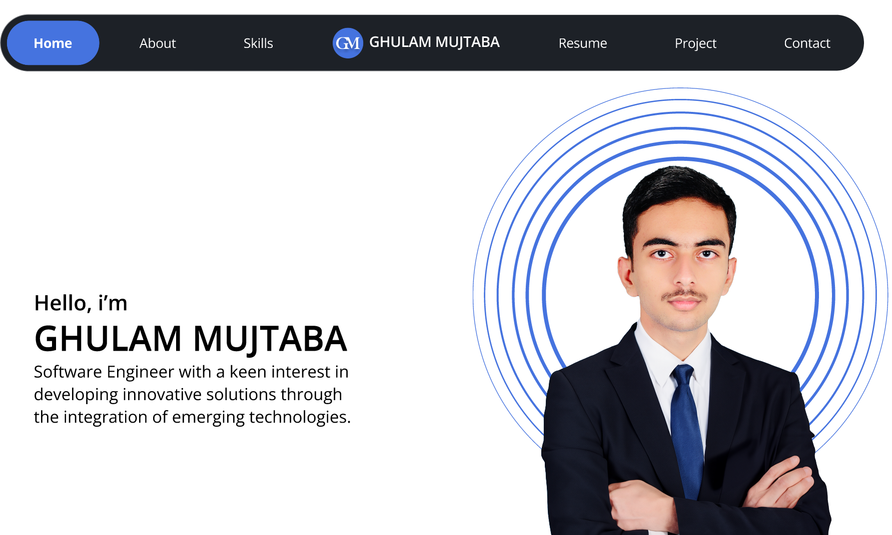

# MyPortfolio

A modern, responsive developer portfolio built with Next.js. This project showcases my skills, projects, and experience in web development, data science, and UI/UX design.

## 🚀 Live Demo
[View Portfolio Live](https://www.ghulammujtaba.com) 

## ✨ Features
- Responsive design for desktop and mobile
- Light and dark theme support
- Project and experience showcase
- Downloadable resume
- Contact form
- Animated UI elements

## 🖼️ Screenshots



## 🛠️ Tech Stack
- Next.js
- React
- CSS Modules
- JavaScript
- HTML5 & CSS3

## 📁 Folder Structure
```
components/         # Reusable UI components
context/            # React context (e.g., ThemeContext)
lib/                # Utility libraries (e.g., gtag.js)
pages/              # Next.js pages
public/             # Static assets (images, icons, etc.)
```

## 🏁 Getting Started
1. **Clone the repository:**
   ```sh
   git clone https://github.com/ghulam-mujtaba5/MyPortfolio.git
   cd MyPortfolio
   ```
2. **Install dependencies:**
   ```sh
   npm install
   ```
3. **Run the development server:**
   ```sh
   npm run dev
   ```
4. Open [http://localhost:3000](http://localhost:3000) to view it in your browser.


## 🙋‍♂️ Contact
Feel free to reach out via [LinkedIn](https://www.linkedin.com/in/ghulamujtabaofficial/) 

---

> Designed & built by [Ghulam Mujtaba].
