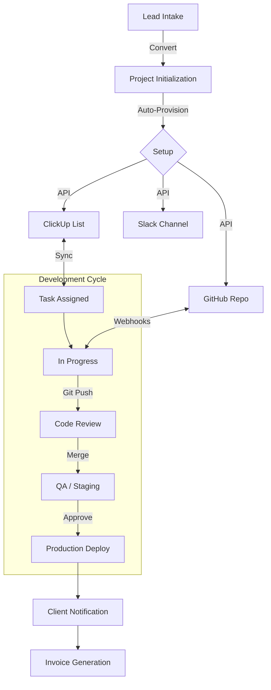

# Megicode Internal Portal - Comprehensive User Guide

## 📘 Introduction
Welcome to the Megicode Internal Portal (MIP), a Silicon Valley-standard Operating System designed specifically for **Software Development Delivery & Project Management**. This platform orchestrates the entire journey from client inception to final product delivery, integrating best-in-class tools like ClickUp, GitHub, and Vercel into a unified "Single Pane of Glass."

**Target Audience:** Evaluators, Professors, Project Managers, Developers, and Clients.

---

## 🧭 Ethical & Professional Standards
At Megicode, we adhere to strict international standards for software delivery, ensuring trust and compliance:

1.  **Data Privacy & Security (GDPR/CCPA):** 
    *   Client data is strictly segregated using tenant IDs.
    *   Access is governed by strict Role-Based Access Control (RBAC).
    *   All sensitive data (API keys, PII) is encrypted at rest and in transit.
2.  **Transparency & Trust:** 
    *   Clients have real-time visibility into project status, reducing "black box" anxiety.
    *   No hidden costs; all time-logs and resource usage are transparently available.
3.  **Accountability & Auditability:** 
    *   Every action (deployment, approval, transaction, task movement) is logged in an immutable audit trail.
    *   "Who did what, when" is always answerable.
4.  **Inclusive Design:** 
    *   The portal is designed to be accessible (WCAG 2.1) and culturally neutral.
    *   Dark/Light mode support for user preference and eye strain reduction.

---

## 🔄 Software Delivery Workflow (The "Megicode Way")

Our workflow is designed for speed, quality, and transparency.

### 1. 👑 Administrator / Agency Owner
**Goal:** High-level oversight and system health.
*   **Dashboard:** View "God Mode" stats—MRR, Global System Health (Uptime), and Team Utilization.
*   **Key Actions:**
    *   **User Management:** Onboard new staff and assign roles.
    *   **Integrations:** Configure API keys for ClickUp, GitHub, and Stripe.
    *   **Audit:** Review system logs for security compliance.

### 2. 📋 Project Manager (PM)
**Goal:** On-time, on-budget delivery.
*   **Workflow:**
    1.  **Lead Intake:** Review incoming leads in the `Leads` pipeline.
    2.  **Project Initialization:** Click "Convert to Project." The system automatically:
        *   Creates a **ClickUp List**.
        *   Provisions a **GitHub Repository**.
        *   Sets up a **Slack/Discord Channel**.
    3.  **Planning:** Use the Gantt chart to visualize timelines. Assign tasks that sync to ClickUp.
    4.  **Monitoring:** Watch the "Live Delivery" dashboard for blocker alerts.

### 3. 💻 Developer / QA Engineer
**Goal:** Focus on code and quality.
*   **Workflow:**
    1.  **Task Pickup:** Log in to see "My Focus" – top 3 priority tasks.
    2.  **Development:**
        *   Work on the assigned branch.
        *   Push code to GitHub.
    3.  **Automation:**
        *   **CI/CD Trigger:** Pushing code automatically updates the Portal task status to "In Review."
        *   **Deployment:** Merging to `main` triggers a Vercel deployment and notifies the PM.
    4.  **Bug Tracking:** View and resolve Sentry errors directly from the portal.

### 4. 🤝 Client (External View)
**Goal:** Visibility and approvals.
*   **Workflow:**
    1.  **Login:** Secure access via magic link.
    2.  **Dashboard:** View simplified progress bars (e.g., "Phase 2: 80% Complete").
    3.  **Approvals:** Review designs or UAT builds and click "Approve" or "Request Changes."
    4.  **Invoicing:** View and pay invoices securely.

---

## 📊 Process Visualization

---

## 🚀 Feature Showcase (For Evaluators)

### ⚡ Instant Monitoring
The portal uses real-time webhooks. When a developer pushes code or a server goes down:
*   **Latency:** < 500ms updates.
*   **Visuals:** Status badges change color instantly (Green -> Red).
*   **Alerts:** Notifications are dispatched to the relevant stakeholders immediately.

### 🔄 Task Forwarding & Automation
We don't just "manage" tasks; we automate their flow:
*   **Auto-Assignment:** Tasks can be auto-assigned based on developer skill tags (e.g., "React" tasks go to Frontend Devs).
*   **Smart Handoffs:** When a Dev marks a task "Ready for QA," it automatically appears in the QA Engineer's dashboard and notifies them.

### 🛠️ Integrations (The "Silicon Valley" Stack)
*   **ClickUp:** For granular task management.
*   **GitHub:** For source control and CI/CD actions.
*   **Resend:** For transactional emails (Welcome packets, Invoices).
*   **Turso (LibSQL):** For edge-compatible, low-latency database performance.

---

## 📖 How to Explore This Portal
1.  **Visit `/internal/explore`:** A guided tour of the architecture and capabilities.
2.  **Visit `/internal/showcase`:** See live demos of the monitoring and workflow engines.
3.  **Login as Admin:** Use the Quick Login (⚡) to see the full feature set.
4.  **Check `/internal/process`:** See the live BPMN visualization of our workflow.
5.  **View `/internal/instances`:** See running project instances and their real-time state.

---

*Built with Next.js 15, React 19, and TypeScript. Deployed on Vercel.*

