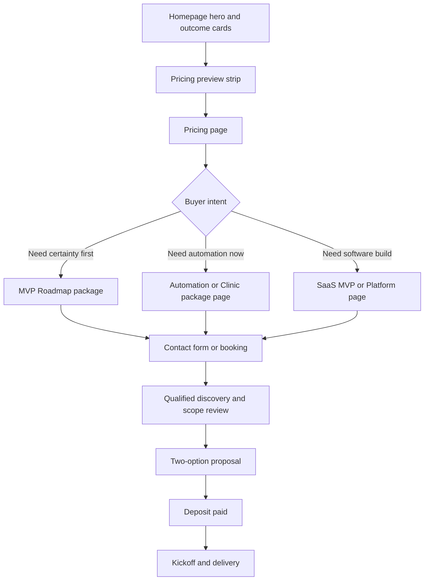

# Megicode USD Pricing Strategy and Website Update Plan

## Executive summary

Megicode should publish a **USD, productized, fixed-scope pricing system** that positions it as a **serious but founder-friendly AI product and automation partner** for US and international buyers: clearly above low-cost freelancers, clearly below premium Western product studios, and credible for a Pakistan-based company whose public proof currently centers on a clinic platform, a student platform, and a conversion-focused marketing website. The best immediate move is to publish **Stage 1 launch pricing now** for discovery, automation, clinic AI receptionist, retainers, and “from” pricing for SaaS MVPs and custom platforms; then raise prices in **Stage 2** after a small set of international wins and testimonials, and in **Stage 3** once Megicode has stronger proof, tighter delivery systems, and recurring support revenue. This recommendation follows Megicode’s current site structure and proof, productized-service guidance, HubSpot pricing-page and value-based pricing guidance, and market benchmarks from Clutch, GoodFirms, and public competitor pricing pages such as RaftLabs, Flowlify, Smith.ai, and RingCentral. citeturn17view0turn2search1turn5view0turn19view7turn19view1turn19view2turn12view6turn12view7turn11view0turn11view1turn18view0turn15search17

## Positioning and research basis

Megicode’s website already does several things well. It presents outcome-led service paths, claims **15+ AI and software products built**, **5+ countries served**, and **10+ startups and businesses partnered**, and it shows three legible public proof assets: **The Aesthetics Place** clinic platform, **CampusAxis**, and **Wajdan Digital Alchemy**. Its Services page already lists offer models such as **MVP Roadmap**, **AI Automation Setup**, **Clinic AI Receptionist**, **Full SaaS MVP Build**, and **Monthly Support / Retainer**. At the same time, I did not find a public pricing page; the contact page still emphasizes a “free consultation,” and the services page currently says “clear ways to start without guessing the budget” without actually publishing prices. That means Megicode already has the right commercial architecture, but not yet the pricing transparency or buyer qualification needed for international conversion. citeturn17view0turn2search1turn17view4turn17view3

The market context matters. Clutch’s 2026 software development pricing guide says reviewed software projects commonly fall in the **$10,000–$49,000** range and that most listed software firms charge **$24–$49/hour**. GoodFirms’ 2026 custom software survey says **56.3%** of surveyed companies price in the **$20–$50/hour** range and that **small to mid-sized projects typically range from $30,000–$100,000**; its website-development survey adds that **63%** of fixed-price web projects fall between **$1,000 and $15,000**, and **60%** of agencies price basic websites and MVPs between **$1,000 and $3,000**. Public competitor pages reinforce the same pattern: RaftLabs openly prices MVP builds from **$10,000**, with more complex AI/integration-heavy products at **$25,000–$75,000**; Flowlify prices clinic AI receptionist packages at **$1,750–$3,500 setup** plus **$350–$750/month**; Smith.ai’s AI Receptionist ranges from **$95/month** entry plans to **managed plans starting at $500/month**, with custom-built AI available as a **$2,000 add-on** for monthly plans; and RingCentral’s AI Receptionist starts at **$39/month**, which is useful as the “software-only” baseline rather than the “custom service” baseline. citeturn12view6turn12view7turn12view8turn11view0turn11view1turn18view0turn15search17

Those benchmarks imply a clear positioning strategy. Megicode should **not** price like a freelancer from a low-cost labor market, because that would undermine trust for US buyers. It should also **not** immediately mimic mature boutiques that already have extensive international proof. Instead, it should sell **fixed-scope packages with strong value framing**, using public USD prices where scope variance is manageable and “from” pricing where scope variance is high. That follows Shopify’s productized-service guidance, which emphasizes flat-rate packages, and HubSpot’s pricing guidance, which argues that publishing pricing can create SEO and lead-generation benefits while insisting that pricing pages use simple language, limited plan counts, prominent CTAs, FAQs, and a recommended plan. HubSpot’s value-based pricing guidance also supports setting price according to perceived customer value rather than raw hours alone. citeturn19view7turn19view1turn19view0turn20view0turn20view1turn19view2turn19view6

The resulting commercial position for Megicode is:

**Founder-friendly AI product engineering partner — fixed scope, clear pricing, international-ready, lower than premium US/UK agencies, higher than low-trust freelance pricing.** This is the right middle ground for Megicode’s current stage and proof. citeturn17view0turn2search1turn12view6turn11view0

## Final pricing system

The **Stage 1 pricing below is the recommended public pricing to publish now**. It is intentionally set to be credible for international buyers while still leaving room for Stage 2 and Stage 3 increases. The package anchors are derived from Megicode’s current public proof and service structure, yet remain safely below the lower end of mature MVP studios and specialist managed AI-receptionist firms. Larger builds use **public “from” or public range pricing** rather than fake one-size-fits-all numbers, because variance in roles, integrations, and workflow depth is too large for a single fixed price. citeturn17view0turn2search1turn5view0turn11view0turn11view1turn18view0turn12view6turn12view8

### Final public pricing table to publish now

| Offer family                   | Package            |     Public price now | Typical timeline   | Visibility   | Billing type | Suggested payment terms                                                       |
| ------------------------------ | ------------------ | -------------------: | ------------------ | ------------ | ------------ | ----------------------------------------------------------------------------- |
| Free Fit Call                  | Qualification call |             **Free** | 20–30 min          | Public       | Free         | None                                                                          |
| MVP Roadmap                    | Basic              |             **$400** | 5–7 business days  | Public       | One-time     | 100% upfront                                                                  |
| MVP Roadmap                    | Advanced           |             **$800** | 7–10 business days | Public       | One-time     | 100% upfront                                                                  |
| AI Automation Setup            | Starter            |             **$900** | 1–2 weeks          | Public       | One-time     | 60% upfront, 40% before handoff                                               |
| AI Automation Setup            | Growth             |           **$1,800** | 2–4 weeks          | Public       | One-time     | 60% upfront, 40% before handoff                                               |
| AI Automation Setup            | Advanced           |           **$3,200** | 3–5 weeks          | Public       | One-time     | 50% upfront, 30% midpoint, 20% before handoff                                 |
| Clinic AI Receptionist         | Starter setup      |           **$1,250** | 2–3 weeks          | Public       | One-time     | 60% upfront, 40% before handoff                                               |
| Clinic AI Receptionist         | Growth setup       |           **$2,250** | 2–4 weeks          | Public       | One-time     | 60% upfront, 40% before handoff                                               |
| Clinic AI Receptionist         | Premium setup      |           **$3,750** | 3–5 weeks          | Public       | One-time     | 50% upfront, 30% midpoint, 20% before handoff                                 |
| Clinic AI Receptionist support | Care               |       **$150/month** | Ongoing            | Public       | Monthly      | Monthly in advance                                                            |
| Clinic AI Receptionist support | Growth             |       **$350/month** | Ongoing            | Public       | Monthly      | Monthly in advance                                                            |
| Clinic AI Receptionist support | Managed            |       **$650/month** | Ongoing            | Public       | Monthly      | Monthly in advance                                                            |
| AI SaaS MVP Build              | Lean MVP           |      **From $4,500** | 4–8 weeks          | Public range | One-time     | 40% kickoff, 40% midpoint, 20% before launch                                  |
| AI SaaS MVP Build              | Core MVP           |   **$6,500–$12,000** | 6–10 weeks         | Public range | One-time     | 30% kickoff, 30% design/scope signoff, 30% build milestone, 10% before launch |
| AI SaaS MVP Build              | Advanced MVP       | **$12,000–$22,000+** | 8–14+ weeks        | Public range | One-time     | 30% / 30% / 30% / 10%                                                         |
| Custom Business Platform       | Starter            |      **From $3,500** | 4–8 weeks          | Public range | One-time     | 40% kickoff, 40% midpoint, 20% before launch                                  |
| Custom Business Platform       | Growth             |   **$5,500–$11,000** | 6–10 weeks         | Public range | One-time     | 30% / 30% / 30% / 10%                                                         |
| Custom Business Platform       | Advanced           | **$11,000–$20,000+** | 8–14+ weeks        | Public range | One-time     | 30% / 30% / 30% / 10%                                                         |
| Monthly Support / Retainer     | Launch Care        |       **$200/month** | Ongoing            | Public       | Monthly      | Monthly in advance                                                            |
| Monthly Support / Retainer     | Growth Support     |       **$450/month** | Ongoing            | Public       | Monthly      | Monthly in advance                                                            |
| Monthly Support / Retainer     | Product Partner    |      **$900+/month** | Ongoing            | Public range | Monthly      | Monthly in advance                                                            |

**What should stay public:** everything in the table above, with “from” pricing for complex builds. **What should stay private:** discount rules, hourly estimates, internal margins, legacy PKR prices, detailed line-item costing, and any bespoke enterprise package beyond the public ranges. That approach fits HubSpot’s guidance to publish pricing but keep the page simple and low-friction. citeturn19view1turn20view0turn20view1

**What must be stated clearly on the pricing page:** “Third-party tools, hosting, telephony, WhatsApp, model/API usage, and paid software licenses are billed separately.” That disclosure is important because automation tools and channels have their own pricing logic: n8n prices by workflow executions, and Twilio’s WhatsApp pricing adds Twilio’s per-message fee plus Meta’s template fees. Flowlify also explicitly separates third-party usage costs from its plan pricing. citeturn12view9turn12view11turn11view1

### Stage escalation ladder

The table below shows **when and how to raise prices**. Stage 2 should begin once Megicode has closed several international clients, collected stronger testimonials, and improved proposal, onboarding, and handoff systems. Stage 3 is the mature target once proof and process justify tighter margins and stronger anchors. The shape of the ladder is intentional: early packages rise first, because discovery and lower-risk entry offers are the easiest place to improve perceived value and margin. The bigger-build ranges then follow as proof grows. This ladder keeps Megicode below premium fixed-price MVP studios such as RaftLabs while moving decisively away from low-anchor startup pricing. citeturn11view0turn12view6turn12view7

| Offer family               | Stage 1 publish now |   Stage 2 growth |   Stage 3 mature |
| -------------------------- | ------------------: | ---------------: | ---------------: |
| Free Fit Call              |                Free |             Free |             Free |
| MVP Roadmap Basic          |                $400 |             $550 |             $750 |
| MVP Roadmap Advanced       |                $800 |           $1,000 |           $1,350 |
| AI Automation Starter      |                $900 |           $1,200 |           $1,500 |
| AI Automation Growth       |              $1,800 |           $2,400 |           $3,000 |
| AI Automation Advanced     |              $3,200 |           $4,300 |           $5,500 |
| Clinic setup Starter       |              $1,250 |           $1,500 |           $1,750 |
| Clinic setup Growth        |              $2,250 |           $2,800 |           $3,250 |
| Clinic setup Premium       |              $3,750 |           $4,600 |           $5,500 |
| Clinic support Care        |             $150/mo |          $200/mo |          $250/mo |
| Clinic support Growth      |             $350/mo |          $450/mo |          $550/mo |
| Clinic support Managed     |             $650/mo |          $850/mo |        $1,100/mo |
| Lean AI SaaS MVP           |         From $4,500 |      From $6,000 |      From $7,500 |
| Core AI SaaS MVP           |      $6,500–$12,000 |   $8,500–$15,000 |  $10,000–$18,000 |
| Advanced AI SaaS MVP       |    $12,000–$22,000+ | $15,000–$28,000+ | $18,000–$35,000+ |
| Starter Business Platform  |         From $3,500 |      From $4,750 |      From $6,000 |
| Growth Business Platform   |      $5,500–$11,000 |   $7,000–$13,500 |   $8,500–$16,000 |
| Advanced Business Platform |    $11,000–$20,000+ | $13,000–$24,000+ | $16,000–$30,000+ |
| Launch Care retainer       |             $200/mo |          $275/mo |          $350/mo |
| Growth Support retainer    |             $450/mo |          $600/mo |          $750/mo |
| Product Partner retainer   |            $900+/mo |       $1,200+/mo |       $1,500+/mo |

### Add-ons table

These add-ons should be used mainly in proposals and upsells. Only a few should appear publicly as “Available add-ons.” Most of the detailed pricing belongs in internal quoting notes rather than on the pricing page, because HubSpot’s pricing-page guidance favors simplicity and low cognitive load. citeturn20view0turn19view5

| Add-on                                        | Recommended price range | Public or private          | Notes                                        |
| --------------------------------------------- | ----------------------: | -------------------------- | -------------------------------------------- |
| Extra workflow                                |               $300–$700 | Private                    | Best attached to automation or clinic scopes |
| Extra integration                             |               $250–$600 | Private                    | CRM, calendar, sheet, API, webhook, etc.     |
| WhatsApp / SMS provisioning support           |               $150–$400 | Private                    | Excludes provider fees                       |
| Extra AI agent / persona / call script branch |             $500–$1,500 | Private                    | Good upsell after proof of ROI               |
| Reporting dashboard add-on                    |             $600–$1,500 | Private                    | Ideal for Growth and Premium packages        |
| Payment integration                           |             $500–$1,000 | Private                    | Stripe, basic deposits, subscriptions        |
| Data migration / import cleanup               |             $400–$1,500 | Private                    | Depends on source quality                    |
| Staff training session                        |               $150–$350 | Public optional            | Can be listed as “Available training”        |
| Extra support month                           |               $150–$650 | Private                    | Use for post-launch extensions               |
| Marketing / sales landing page                |             $900–$1,800 | Private or public optional | Use carefully; do not make it the hero offer |
| Admin panel expansion                         |           $1,000–$3,000 | Private                    | Better sold after MVP approval               |
| Additional environment / deployment           |               $250–$800 | Private                    | Staging, backup, analytics, monitoring       |

## Website content and page plan

The website should move from a portfolio-plus-contact model to a **pricing-qualified buyer journey**. Right now, Megicode’s nav and contact flow are service-oriented, but not yet pricing-oriented: the site advertises capability and proof, then sends visitors to a generic consultation form. The update plan should change that journey into **Homepage → Pricing → service landing page or contact form → proposal**, with case studies acting as proof and pricing as the buyer-qualification layer. That structure is consistent with HubSpot’s guidance to reduce friction, keep pricing pages understandable, add FAQs, and make next-step CTAs prominent. citeturn17view3turn20view0turn19view5

**Recommended Pricing page hero copy**

**Headline:**  
**Clear pricing for AI automation, SaaS MVPs, and custom business platforms**

**Subheadline:**  
Productized entry points for founders, clinics, and growing businesses — with fixed-scope packages, practical timelines, and transparent starting prices. Third-party software, hosting, telephony, WhatsApp, and AI usage are billed separately.

**Primary CTA:**  
**Book Free Fit Call**

**Secondary CTA:**  
**See Packages**

That language is intentionally simple, concrete, and outcome-led, which matches HubSpot’s pricing-page advice more closely than technical jargon would. citeturn20view0turn19view5

### Page-content mapping table

| Page                      | URL                                   | Status              | Content blocks to include                                                                      | UI components                                                                                          | Primary CTA              |
| ------------------------- | ------------------------------------- | ------------------- | ---------------------------------------------------------------------------------------------- | ------------------------------------------------------------------------------------------------------ | ------------------------ |
| Homepage                  | `/`                                   | Update              | Hero, trust strip, outcome-based services, pricing preview, proof strip, process, FAQ-lite     | HeroBanner, TrustBar, ServiceCards, PricingPreview, ProofStrip, CTASection                             | View Pricing             |
| Pricing                   | `/pricing`                            | New                 | Hero, package tabs, comparison table, cost drivers, proof links, FAQ, CTA                      | PricingHero, PricingTabs, PricingCards, ComparisonTable, CostDriversAccordion, FAQAccordion, StickyCTA | Book Free Fit Call       |
| Services hub              | `/services`                           | Update              | Core services, “ways to start” with prices, links to service pages, proof callouts             | ServiceGrid, StartHereCards, PriceChips, ProofLinks                                                    | Compare Packages         |
| Clinic AI Receptionist    | `/services/clinic-ai-receptionist`    | New or major update | Hero, clinic pain points, workflow explainer, packages, ROI logic, Aesthetics Place proof, FAQ | HeroBanner, ProblemCards, WorkflowDiagram, PricingCards, ROIBlock, CaseStudyCallout, FAQAccordion      | Automate Clinic Bookings |
| AI Automation             | `/services/ai-automation`             | New or major update | Hero, processes automated, packages, integrations, “what’s separate,” FAQ                      | HeroBanner, AutomationExamples, PricingCards, IntegrationLogos, ScopeBox, FAQAccordion                 | See What We Can Automate |
| AI SaaS MVP               | `/services/ai-saas-mvp-development`   | New or major update | Two paths: roadmap vs build, tier ranges, process, proof, FAQ                                  | SplitHero, PathSelector, TierCards, ProcessTimeline, ProofStrip, FAQAccordion                          | Start With Roadmap       |
| Custom Business Platforms | `/services/custom-business-platforms` | New or major update | Use cases, pricing ranges, scope drivers, case links, FAQ                                      | HeroBanner, UseCaseGrid, TierCards, CostDriversAccordion, ProofStrip                                   | Build My Platform        |
| Case Studies hub          | `/projects`                           | Update              | Problem, solution, outcomes, timeline, relevant starting price, CTA per case                   | CaseStudyCards, OutcomeMetrics, PriceCallouts, CTAButtons                                              | Start Similar Project    |
| Contact                   | `/contact`                            | Update              | Short hero, qualification fields, budget bands, booking option, FAQ                            | SmartForm, BudgetDropdown, TimelineDropdown, StageDropdown, CalendarEmbed                              | Send Project Details     |
| Insights / Blog           | `/insights` or `/article/*`           | Update              | Pricing content cluster, buyer guides, comparison posts                                        | ArticleCards, RelatedLinks, CTAInline                                                                  | View Pricing             |

**Homepage pricing preview copy**

Use a compact five-card strip with **entry anchors only**:

- **MVP Roadmap — from $400**
- **AI Automation Setup — from $900**
- **Clinic AI Receptionist — from $1,250 setup**
- **AI SaaS MVP Build — from $4,500**
- **Custom Business Platform — from $3,500**

This gives buyers enough budget context to self-qualify without turning the homepage into a giant pricing matrix. That is especially important because HubSpot recommends limiting plan complexity and keeping the page simple. citeturn19view3turn19view5

**Recommended pricing card copy**

Use “best for” language before feature bullets, because buyers identify with the problem first.

Example card for **AI Automation Growth**:

> **AI Automation Growth**  
> **$1,800**  
> Best for teams losing leads in replies, booking, follow-up, or CRM updates.  
> **Timeline:** 2–4 weeks  
> Includes workflow mapping, 2–3 automations, core integrations, testing, handoff, and launch support.  
> **CTA:** See What We Can Automate

Example card for **Clinic Growth setup**:

> **Clinic AI Receptionist Growth**  
> **$2,250 setup**  
> Best for clinics handling inbound inquiries across WhatsApp, forms, missed calls, and staff handoffs.  
> **Timeline:** 2–4 weeks  
> Includes intake logic, booking flow, reminders, routing, reporting basics, and handoff setup.  
> **CTA:** Automate Clinic Bookings

**Recommended FAQs for Pricing and Contact**

Use these exact questions or very close variants:

| FAQ question                                             | Answer direction                                                          |
| -------------------------------------------------------- | ------------------------------------------------------------------------- |
| Do you charge hourly or fixed price?                     | Fixed price for well-scoped packages; milestone pricing for larger builds |
| Are hosting, WhatsApp, telephony, and AI usage included? | No; billed separately at provider rates                                   |
| What if I am not ready to build yet?                     | Start with MVP Roadmap                                                    |
| Can we launch a smaller version first?                   | Yes; validate with the smallest useful version                            |
| Do you work with international clients?                  | Yes; Megicode is Lahore-based and serves clients globally                 |
| How long does a typical automation take?                 | 1–5 weeks depending on workflow depth                                     |
| What happens after launch?                               | Optional monthly support tiers                                            |
| Can you sign an NDA?                                     | Yes, on request                                                           |
| What if I need something outside the package?            | Add-ons or scoped proposal                                                |
| Which package is right for me?                           | Book the Free Fit Call                                                    |

**Contact form fields to add**

Megicode’s current contact page collects basics, but it should do far more qualification upstream. Add these fields:

- Budget range
- Desired timeline
- Project stage
- Type of work: new build / improvement / automation / support
- Need NDA? yes/no
- Do you already have designs, requirements, or content? yes/no
- Time zone / preferred contact time
- How did you hear about us?

**Recommended budget ranges**

- Under $500
- $500–$1,500
- $1,500–$3,500
- $3,500–$7,500
- $7,500–$15,000
- $15,000–$30,000
- $30,000+
- Not sure yet

**Case-study callouts to add**

Megicode’s project pages should stop being purely descriptive and become commercial proof assets:

- **The Aesthetics Place:** “Need a similar clinic booking and operations setup? Clinic AI Receptionist starts at **$1,250 setup**. Full clinic platform projects start at **$3,500**.”
- **CampusAxis:** “Building a community, portal, or education platform? Lean MVPs start at **$4,500**.”
- **Wajdan Digital Alchemy:** “Need a high-converting growth website or sales layer? Landing-page add-ons start at **$900**; full custom platform work starts at **$3,500**.”

These case-study price callouts turn proof into direction and reduce friction at the decision moment. citeturn2search1turn20view0

## UI, UX, conversion, and accessibility

The pricing experience should use **progressive disclosure**, not a giant all-in-one table at the top. Start with a clean hero, then show **category tabs** such as **Roadmap**, **Automation**, **Clinic**, **SaaS MVP**, **Platforms**, and **Support**. Inside each tab, show **three cards max**, followed by a comparison table and then FAQs. This directly reflects HubSpot’s guidance to keep language simple, reduce friction, limit options, highlight a recommended plan, add FAQs, and use a prominent CTA. citeturn20view0turn19view3turn19view5

The visual hierarchy should highlight the **middle plan** for package families with three options. For Megicode, that means **Automation Growth** and **Clinic Growth** should be the “Most Popular” cards. HubSpot’s pricing guidance notes that highlighting a recommended plan can reduce buyer confusion and improve plan selection. The “most popular” treatment should be visual but restrained: slightly stronger border, slightly larger card, clear label, and more generous whitespace. Do **not** rely only on color to communicate the recommendation. citeturn20view0

Mobile behavior should be intentionally designed rather than inherited from desktop. Pricing cards should stack vertically or become a swipeable row; comparison tables should collapse into accordions; and a sticky bottom CTA should remain visible with either **Book Free Fit Call** or **Start With Roadmap** depending on page context. Button targets should be large enough to tap reliably, visible keyboard focus indicators should be preserved, and contrast should remain strong enough for pricing text and card labels to stay legible. WCAG guidance supports visible focus, sufficient contrast, and adequate target size. citeturn21search2turn21search6turn21search4turn21search8

For accessibility, use these operating rules across pricing and contact pages:

- Text contrast of at least **4.5:1** for normal text. citeturn21search6
- Visible keyboard focus states on every interactive element. citeturn21search2turn21search8
- Tap targets of about **44 × 44 CSS pixels** for key controls where feasible. citeturn21search4
- Semantic headings, real buttons, real table headers, and ARIA-compatible accordions.
- “Most Popular” communicated by text label and structure, not color alone.
- Pricing tables should have an accessible mobile alternative rather than horizontal overflow as the only method.

**Recommended frontend component list**

PricingHero, PricingTabs, PricingCard, TierBadge, ComparisonTable, CostDriversAccordion, ProofStrip, ROIBlock, FAQAccordion, SmartContactForm, StickyMobileCTA, and CaseStudyPriceCallout.

## Proposal, payment, and commercial policy

Megicode’s proposal strategy should mirror the public pricing system instead of restarting the pricing conversation from zero every time. Every serious proposal should show **two options**: a **recommended option** and a **scaled option**. This follows the commercial logic behind productized services and reduces the “custom quote every time” problem. It also aligns with HubSpot’s price-proposal guidance, which emphasizes finding a fair price point without underselling, and with Megicode’s own move toward clear buyer-entry models on the services page. citeturn19view6turn17view4

**Recommended proposal structure**

- Client problem and intended business outcome
- Scope summary in plain English
- Recommended option
- Scaled option
- Timeline
- What is included
- What is excluded
- Third-party cost note
- Payment schedule
- Validity window
- Next step and kickoff date

**Example**

- **Recommended:** Clinic AI Receptionist Growth — $2,250 setup + $350/month support
- **Scaled:** Clinic AI Receptionist Starter — $1,250 setup + optional $150/month support

That structure keeps negotiation inside Megicode’s package system rather than letting buyers drag the conversation toward hourly pricing.

### Payment schedule table

| Package size / type                      | Recommended schedule                                                                | Why                                                 |
| ---------------------------------------- | ----------------------------------------------------------------------------------- | --------------------------------------------------- |
| Free Fit Call                            | No payment                                                                          | Qualification only                                  |
| Roadmap packages                         | 100% upfront                                                                        | Short, fixed-scope, low delivery risk               |
| Automation and clinic setup under $2,500 | 60% upfront / 40% before handoff                                                    | Simple enough to avoid multi-milestone overhead     |
| Automation and clinic setup above $2,500 | 50% upfront / 30% midpoint / 20% before handoff                                     | Protects cash flow and scope discipline             |
| Lean MVP and starter platforms           | 40% kickoff / 40% midpoint / 20% before launch                                      | Balanced for 4–8 week projects                      |
| Core and advanced MVP/platform builds    | 30% kickoff / 30% scope or design signoff / 30% build milestone / 10% before launch | Best for larger scopes with deliverable checkpoints |
| Monthly support / retainers              | 100% monthly in advance                                                             | Prevents unpaid ongoing support                     |
| Add-on work during active projects       | 100% upfront if under $750; otherwise attach to next milestone                      | Keeps change requests clean                         |

**Add-on pricing policy**

Use add-ons to protect package integrity. If an extra request changes the deliverable stack, the correct move is either an add-on or a re-scope, not “just squeezing it in.” Keep all add-on rates private except where a public upsell improves conversion, such as training or optional post-launch support. This supports the same simplicity and clarity principles that HubSpot recommends for pricing pages. citeturn20view0turn19view5

## Rollout and risk management

Megicode’s biggest pricing risk is not “being too expensive.” It is **confusing the market with old local-price memory while trying to look credible to international buyers**. The transition should therefore be explicit: **all public pricing becomes USD-only**, legacy PKR pricing disappears from sales messaging, and existing clients are handled through private grandfathering rather than public references. This is especially important because Megicode already presents itself as a global service partner on-site. citeturn17view0turn17view3

For existing clients and local referrals, use this message privately:

> We’ve updated Megicode’s public pricing to a USD package system for international and cross-border work. Existing clients can keep current terms until the next renewal or re-scope point. New work will follow our updated package structure.

For international leads, use this message publicly:

> We use transparent USD pricing for core packages, then scope larger builds after the fit call. This keeps budgets clear without oversimplifying complex projects.

Do **not** publicly mention old PKR project fees, even as “proof of affordability.” Those numbers would materially weaken Megicode’s trust signal for international buyers.

### Stage rollout timeline

| Time window | Pricing stage    | Operational goal                                                                                                       | Trigger to advance                                                               |
| ----------- | ---------------- | ---------------------------------------------------------------------------------------------------------------------- | -------------------------------------------------------------------------------- |
| Month 0–1   | Stage 1 live     | Launch `/pricing`, unify service naming, improve contact qualification, begin quoting only in USD for new public leads | Pricing page live, new proposal template live                                    |
| Month 1–3   | Stage 1 optimize | Collect objections, refine FAQs, publish first pricing blog posts, track which package gets viewed and booked most     | At least 3 qualified proposals using new system                                  |
| Month 3–4   | Stage 2 prep     | Raise roadmap and entry-package pricing first; improve proof with testimonials and more detailed case outcomes         | 2–3 international clients or equivalent strong testimonials                      |
| Month 4–5   | Stage 2 live     | Increase automation, clinic, and retainer pricing; tighten package boundaries; document onboarding and handoff SOPs    | Stable close rate after first increase                                           |
| Month 5–6   | Stage 3 prep     | Add stronger metrics to case studies, publish ROI examples, collect post-launch support wins                           | Repeatable fulfillment and lower revision volatility                             |
| Month 6+    | Stage 3 target   | Move to mature anchors across roadmap, automation, clinic, and build ranges                                            | 5+ strong testimonials, stronger international proof, cleaner delivery economics |

The practical path to Stage 3 is to raise prices **in sequence**, not all at once. Start with discovery and roadmap, then entry automation packages, then bigger build ranges. That is commercially safer because the lower-risk offers are easiest for buyers to test and easiest for Megicode to defend with improved process and positioning. It also keeps Megicode below mature specialist benchmarks while steadily pulling it away from underpriced legacy work. citeturn11view0turn11view1turn18view0turn12view6turn12view8

**Launch messaging to use now**

Use language such as:

- **Founder-friendly launch pricing**
- **Clear starting prices**
- **Fixed-scope packages**
- **Built for startups, clinics, and growing businesses**
- **Roadmap first if you are not ready to build**

Avoid language such as:

- cheap
- affordable development
- low-cost hire
- budget developers
- best price guaranteed
- price on request everywhere
- custom quote for everything

That “avoid” list matters because Megicode is trying to build trust and perceived value, not compete in a commodity marketplace. HubSpot’s value-based pricing and pricing-page guidance both argue, in different ways, for making value legible rather than collapsing the conversation into raw cost. citeturn19view2turn20view0turn19view5

**Suggested pricing-content SEO plan**

| Blog title                                   | Target keyword theme                                                             | Purpose                                             |
| -------------------------------------------- | -------------------------------------------------------------------------------- | --------------------------------------------------- |
| How Much Does AI Automation Cost in 2026?    | ai automation cost, ai automation pricing, workflow automation pricing           | Capture high-intent automation buyers               |
| How Much Does a Clinic AI Receptionist Cost? | ai receptionist cost, clinic ai receptionist pricing, medical booking automation | Support the clinic landing page and package anchors |
| MVP Roadmap vs MVP Build                     | mvp roadmap, mvp build cost, saas mvp pricing                                    | Pull unsure founders into the roadmap offer         |

HubSpot explicitly notes that pricing pages and pricing content can generate SEO wins and conversion opportunities when the market wants price clarity. For Megicode, that is especially useful because many agencies still hide pricing or bury it behind calls. citeturn19view0turn19view1

The final recommendation is to **publish Stage 1 immediately**, build the website around it, and treat that pricing not as a discount apology but as a strategic launch position: high enough to signal quality, low enough to match current proof, and structured enough to scale cleanly into Stage 2 and Stage 3.

if you msiing nay detail or confusing how do add in ui ux so more extra detail has below
just use teh finamtion you need ignore teh others uselles things instarcuations
Yes. Use this as the **final UI/UX implementation plan** for adding pricing to Megicode.com. The goal is not just to show prices. The goal is to make pricing feel **serious, trustworthy, founder-friendly, clear, and conversion-focused**.

# 1. Final pricing to design around

Use this as the final public pricing for now:

| Service                        |                    Public pricing |
| ------------------------------ | --------------------------------: |
| Free Fit Call                  |                              Free |
| MVP Roadmap Basic              |                          **$400** |
| MVP Roadmap Advanced           |                          **$800** |
| AI Automation Starter          |                          **$900** |
| AI Automation Growth           |                        **$1,800** |
| AI Automation Advanced         |                        **$3,200** |
| Clinic AI Receptionist Starter |     **$1,250 setup + $150/month** |
| Clinic AI Receptionist Growth  |     **$2,250 setup + $350/month** |
| Clinic AI Receptionist Premium |     **$3,750 setup + $650/month** |
| AI SaaS MVP Build              |                   **From $4,500** |
| Custom Business Platform       |                   **From $3,500** |
| Monthly Support                | **$200 / $450 / $900+ per month** |

This pricing feels credible internationally without jumping too far from your current proof level.

---

# 2. Main UI/UX strategy

Megicode pricing should feel like:

> “We are not a cheap freelancer. We are not an expensive enterprise agency. We are a focused AI product partner with clear entry points.”

So the pricing UI must follow 5 principles:

1. **Clear before clever**
   No confusing animations, no overdesigned pricing grid, no visual noise.

2. **Show entry price, then explain scope**
   Buyers first ask: “Can I afford this?” Then they ask: “What do I get?”

3. **Use progressive disclosure**
   Show simple package cards first. Then comparison table. Then FAQs. Do not show everything at once.

4. **Make the middle plan preferred**
   For AI Automation and Clinic AI Receptionist, the Growth package should be highlighted as **Most Popular**.

5. **Reduce fear**
   Add notes like “Start with Roadmap if you are not ready to build” and “Third-party tools billed separately.”

---

# 3. Website navigation update

Current navigation should become:

**Home | Services | Pricing | Projects | Insights | Contact**

Primary CTA button:

**Book Free Fit Call**

Secondary CTA on pricing-related pages:

**Start With Roadmap**

Do not make “Contact” the only CTA. International buyers want to see pricing before contacting.

---

# 4. New `/pricing` page layout

This page is highest priority.

## Section 1: Pricing hero

Layout:

Left side: headline, subheadline, CTA
Right side: clean pricing visual, not a messy dashboard

Hero headline:

**Clear pricing for AI automation, MVPs, and business platforms**

Subheadline:

**Fixed-scope entry packages for startups, clinics, and growing businesses — with practical timelines, clear deliverables, and USD pricing for international clients.**

Small trust line under CTA:

**Third-party tools, hosting, WhatsApp, telephony, and AI API usage are billed separately.**

Buttons:

Primary: **Book Free Fit Call**
Secondary: **Compare Packages**

Hero visual idea:

A clean 3D pricing stack:

- Roadmap card: $400
- Automation card: from $900
- MVP card: from $4,500

No robot. No magnifying glass. No generic dashboard clutter.

---

## Section 2: “Choose the best way to start”

Use 5 horizontal cards.

| Card                   |             Price | CTA                      |
| ---------------------- | ----------------: | ------------------------ |
| MVP Roadmap            |         From $400 | Start With Roadmap       |
| AI Automation          |         From $900 | Automate Workflow        |
| Clinic AI Receptionist | From $1,250 setup | Automate Clinic Bookings |
| AI SaaS MVP            |       From $4,500 | Plan My MVP              |
| Custom Platform        |       From $3,500 | Build My Platform        |

Each card should have:

- title
- price
- one-line “best for”
- 3 bullet points max
- CTA

Do not use more than 5 cards in this section.

---

## Section 3: Pricing tabs

Use tabs instead of one huge pricing table.

Tabs:

1. **Roadmap**
2. **Automation**
3. **Clinic**
4. **SaaS MVP**
5. **Platforms**
6. **Support**

This reduces mental load.

Desktop: horizontal tabs
Mobile: dropdown or horizontal scroll pills

---

# 5. Pricing card design

## Card structure

Each pricing card should follow this order:

1. Package name
2. Best-for line
3. Price
4. Timeline
5. Includes
6. Not included note
7. CTA

Example:

**AI Automation Growth**
Best for teams losing leads, time, and follow-ups across manual tools.

**$1,800**

Timeline: **2–4 weeks**

Includes:

- 2–3 automated workflows
- CRM, Sheets, Email, WhatsApp, or form integration
- Follow-up and notification logic
- Testing and handover
- 14-day launch support

CTA: **See What We Can Automate**

Small note:

**Tool/API costs billed separately.**

---

## Visual style for cards

Use:

- soft rounded corners: 20–24px
- subtle border
- deep navy background in dark mode
- white/light background in light mode
- no heavy glow
- no too much glassmorphism
- orange only for CTA, badge, and small highlights

Most Popular card:

- slightly larger scale: 1.03
- stronger border
- badge: **Most Popular**
- slightly stronger shadow
- not too much orange

Do not use heavy animations on price numbers. Pricing should feel stable and serious.

---

# 6. Exact page sections for `/pricing`

Use this order:

## 1. Hero

Purpose: clarity and trust.

## 2. Pricing preview cards

Purpose: quick understanding.

## 3. Package tabs

Purpose: detailed package selection.

## 4. Comparison table

Purpose: help serious buyers compare.

## 5. What affects price

Purpose: explain why price may change.

Include these factors:

- number of workflows
- AI complexity
- integrations
- dashboard/admin needs
- user roles
- data migration
- WhatsApp/telephony/API usage
- support level

## 6. Proof strip

Show:

- 15+ products built
- 5+ countries served
- 10+ startups/businesses partnered
- The Aesthetics Place
- CampusAxis
- Wajdan Digital Alchemy

## 7. FAQ

Purpose: remove objections.

## 8. Final CTA

Headline:

**Not sure which package fits?**

Text:

**Book a free fit call and we’ll recommend the safest starting point based on your goals, scope, and budget.**

CTA:

**Book Free Fit Call**

---

# 7. Homepage pricing section

Do not put a full pricing table on homepage.

Add one section after services:

## Section title

**Clear ways to start — without guessing the budget**

Subtext:

**Start small with a roadmap or automation package, then scale into a full MVP or custom platform when the scope is clear.**

Cards:

1. MVP Roadmap — from **$400**
2. AI Automation — from **$900**
3. Clinic AI Receptionist — from **$1,250 setup**
4. AI SaaS MVP — from **$4,500**
5. Custom Platform — from **$3,500**

CTA:

**View Pricing**

Secondary:

**Book Free Fit Call**

Keep this section simple. It should build confidence, not explain everything.

---

# 8. Services page update

On `/services`, add a section called:

**Productized ways to work with Megicode**

Use 6 cards:

1. MVP Roadmap
2. AI Automation Setup
3. Clinic AI Receptionist
4. AI SaaS MVP Build
5. Custom Business Platform
6. Monthly Support

Each service card should show:

- starting price
- timeline
- best for
- CTA

Example:

**Clinic AI Receptionist**
From **$1,250 setup + $150/month**
For clinics that want to capture inquiries, qualify patients, automate booking, and reduce missed follow-ups.
CTA: **View Clinic Packages**

---

# 9. Dedicated service pages

## A. Clinic AI Receptionist page

URL:

`/services/clinic-ai-receptionist`

This page should be your strongest sales page.

### Page structure

1. Hero
2. Pain points
3. AI receptionist workflow
4. Packages
5. Case study proof
6. What is included
7. What is separate
8. FAQ
9. CTA

Hero headline:

**AI Receptionist for Clinics That Cannot Afford Missed Patient Inquiries**

Subheadline:

**Megicode builds clinic booking and intake systems that capture inquiries, ask the right questions, route patients, remind staff, and keep your front desk organized.**

Workflow visual:

Inquiry → AI intake → booking → staff handoff → reminder → reporting

Packages:

| Package |                     Price |
| ------- | ------------------------: |
| Starter | $1,250 setup + $150/month |
| Growth  | $2,250 setup + $350/month |
| Premium | $3,750 setup + $650/month |

Highlight **Growth**.

---

## B. AI Automation page

URL:

`/services/ai-automation`

Hero headline:

**Automate the repetitive work slowing your business down**

Subheadline:

**We design and build AI-powered workflows for lead capture, booking, CRM updates, follow-ups, reporting, and internal handoffs.**

Packages:

| Package  |  Price |
| -------- | -----: |
| Starter  |   $900 |
| Growth   | $1,800 |
| Advanced | $3,200 |

Highlight **Growth**.

Show automation examples:

- lead form → CRM → email follow-up
- WhatsApp inquiry → qualification → team notification
- appointment booking → reminder → report
- spreadsheet update → dashboard → weekly summary

Do not make tools the hero. Tools are supporting details.

---

## C. AI SaaS MVP page

URL:

`/services/ai-saas-mvp-development`

This page should reduce founder fear.

Hero headline:

**Build your AI SaaS MVP without wasting months on unclear scope**

Show two paths:

| Path                                       |       Price |
| ------------------------------------------ | ----------: |
| Not ready to build? Start with MVP Roadmap |   $400–$800 |
| Ready to build? Start AI SaaS MVP          | From $4,500 |

This is psychologically strong because unsure founders can buy a smaller first step instead of leaving.

---

## D. Custom Business Platform page

URL:

`/services/custom-business-platforms`

Hero headline:

**Custom business platforms for teams outgrowing spreadsheets and scattered tools**

Examples:

- CRM
- patient portal
- booking system
- admin dashboard
- internal operations system
- reporting platform
- client portal

Pricing:

**From $3,500**

Show ranges:

- Starter: from $3,500
- Growth: $5,500–$11,000
- Advanced: $11,000–$20,000+

---

# 10. Contact page update

The Contact page must qualify leads.

Add these fields:

- Name
- Email
- Company
- Country
- Service interested in
- Budget range
- Timeline
- Project stage
- Message
- Do you already have designs/requirements?
- Need NDA?
- Preferred meeting time zone

Budget dropdown:

- Under $500
- $500–$1,500
- $1,500–$3,500
- $3,500–$7,500
- $7,500–$15,000
- $15,000–$30,000
- $30,000+
- Not sure yet

Important: do not block low-budget users aggressively. Let them select budget, then guide them to Roadmap or smaller package.

---

# 11. Psychological pricing details

## Use rounded prices

Use:

- $400
- $800
- $900
- $1,800
- $3,200
- $4,500

Do not use:

- $397
- $799
- $899

For Megicode, rounded pricing feels more professional and B2B. Charm pricing can look cheap.

## Use “from” pricing for complex work

Correct:

**AI SaaS MVP Build — from $4,500**

Wrong:

**AI SaaS MVP — $4,500 only**

Complex projects need scope flexibility.

## Use “setup + monthly” for clinic

This is important.

Clinic AI Receptionist should not be only one-time pricing. Use:

**$1,250 setup + $150/month**

This creates recurring revenue and sets expectation for ongoing monitoring.

## Use “Most Popular” only once per pricing group

Do not put too many badges.

Use it only on:

- AI Automation Growth
- Clinic AI Receptionist Growth
- Growth Support

---

# 12. Animation plan

Keep animation premium and calm.

## Good animations

Use:

- pricing cards fade up on scroll
- slight card lift on hover
- border glow on selected tab
- number counter only for trust metrics
- subtle background gradient movement
- accordion smooth open/close
- sticky CTA slide-in on mobile

## Avoid

- bouncing cards
- spinning icons
- heavy 3D movement
- auto-rotating pricing cards
- too much orange glow
- moving price numbers
- random AI particles everywhere

Pricing should feel stable. Too much motion reduces trust.

---

# 13. Desktop layout

Use this structure:

- max width: 1180–1280px
- pricing card grid: 3 columns
- section spacing: 80–120px
- card padding: 28–36px
- card radius: 20–24px
- CTA height: 48–56px
- comparison table after cards

For package tabs:

Desktop:

`Roadmap | Automation | Clinic | SaaS MVP | Platforms | Support`

Cards below in 3-column layout.

---

# 14. Mobile layout

Mobile is critical.

Use:

- one pricing card per row
- sticky bottom CTA
- tabs as horizontal scroll pills
- comparison table as accordion
- price visible without scrolling too much
- CTA immediately under price
- no giant hero visual on mobile

Sticky mobile CTA:

**Book Free Fit Call**

Small secondary text:

**Not sure? Start with a free fit review.**

Button height should feel tappable and premium.

---

# 15. Light and dark mode

Pricing must work in both.

## Dark mode

Background:

- deep navy
- subtle gradient
- cards slightly lighter than background
- orange accent for CTA only

## Light mode

Background:

- off-white / very light blue-gray
- dark navy text
- cards white
- soft shadows
- orange CTA

Do not use pure black and pure white everywhere. It looks harsh.

Suggested palette:

| Use              | Color                    |
| ---------------- | ------------------------ |
| Dark background  | `#07111F`                |
| Dark card        | `#0E1A2B`                |
| Light background | `#F7F9FC`                |
| Light card       | `#FFFFFF`                |
| Main text dark   | `#F8FAFC`                |
| Main text light  | `#0B1220`                |
| Muted text       | `#64748B`                |
| Brand accent     | `#F97316`                |
| Soft accent      | `#FDBA74`                |
| Border dark      | `rgba(255,255,255,0.10)` |
| Border light     | `rgba(15,23,42,0.10)`    |

---

# 16. Best visual assets for pricing page

Do not use generic icons.

Use custom 3D/abstract assets:

## Hero asset idea

**3D pricing architecture stack**

Visual concept:

- layered cards
- small nodes connecting service types
- clean software/product blocks
- one highlighted orange path
- labels: Roadmap, Automation, MVP, Platform

Meaning:

Megicode gives structured paths, not random quotes.

## Clinic page asset

**Clinic booking flow object**

Visual concept:

- patient message bubble
- appointment calendar
- staff handoff card
- reminder signal
- clean medical/clinic tone

No doctor stock photo needed.

## Automation page asset

**Workflow pipeline**

Visual concept:

- input card → AI logic block → CRM card → notification card
- no messy dashboard

## SaaS MVP page asset

**Product build blueprint**

Visual concept:

- product screen wireframe
- database block
- AI module
- launch arrow

## Platform page asset

**Business operating system**

Visual concept:

- CRM module
- dashboard module
- user roles
- analytics card
- connected as a clean system

---

# 17. Comparison table design

Do not show huge technical comparison first.

After pricing cards, show a simple table.

Columns:

- Feature
- Starter
- Growth
- Advanced

Rows for AI Automation:

- workflows
- integrations
- AI logic
- dashboard/reporting
- testing
- support
- best for

On mobile, each row becomes accordion.

Example:

**How many workflows are included?**
Starter: 1
Growth: 2–3
Advanced: 4–6

This is easier than a cramped table.

---

# 18. FAQ section

Use accordion.

Questions:

1. Do you charge hourly or fixed price?
2. Are hosting, WhatsApp, telephony, and AI usage included?
3. What if I am not ready to build yet?
4. Can we start smaller first?
5. What happens after launch?
6. Do you work with international clients?
7. Can you sign an NDA?
8. How do payments work?
9. Can pricing change after the quote?
10. Which package should I choose?

Important answer style:

Short. Clear. No legal-heavy language.

---

# 19. Trust signals near pricing

Near the pricing section, show:

- 15+ AI & software products built
- 5+ countries served
- 10+ startups and businesses partnered
- The Aesthetics Place
- CampusAxis
- Wajdan Digital Alchemy

Also add:

**Built with modern AI, SaaS, automation, and cloud tools**

Then small logos/text chips:

Next.js, FastAPI, Supabase, Appwrite, OpenAI, n8n, Vercel, Cloudflare, PostgreSQL

Do not overfill with 30 tools. Keep it premium.

---

# 20. Conversion flow

Use this flow:

Homepage → Pricing preview → Pricing page → Service page → Contact form / call booking → Proposal

For uncertain buyers:

Homepage → MVP Roadmap → Contact → Roadmap purchase

For clinic buyers:

Clinic page → Clinic Growth package → Contact form → Fit call

For big build buyers:

SaaS MVP page → Start with Roadmap or Fit Call → Proposal

This avoids forcing every visitor into one generic contact form.

---

# 21. Exact CTA system

Use these CTAs consistently:

| Page       | Primary CTA              | Secondary CTA      |
| ---------- | ------------------------ | ------------------ |
| Home       | View Pricing             | Book Free Fit Call |
| Pricing    | Book Free Fit Call       | Compare Packages   |
| Services   | Compare Packages         | View Projects      |
| Clinic     | Automate Clinic Bookings | View Pricing       |
| Automation | See What We Can Automate | Book Free Fit Call |
| SaaS MVP   | Start With Roadmap       | Book Free Fit Call |
| Platform   | Build My Platform        | View Pricing       |
| Contact    | Send Project Details     | Book Free Fit Call |

Do not use 10 different CTA styles. Keep it consistent.

---

# 22. What to remove or avoid

Avoid these on pricing UI:

- too many pricing cards
- too many icons
- too many animations
- generic robot image
- generic magnifying glass image
- cluttered dashboard screenshots
- “cheap” language
- hourly rate display
- PKR pricing
- “custom quote only” for every service
- large paragraph inside cards
- too many badges like “Best Value,” “Popular,” “Recommended,” “Limited”

Keep pricing clean and confident.

---

# 23. Copywriting tone

Use this tone:

- clear
- calm
- premium
- founder-friendly
- practical
- honest

Use phrases like:

**Clear starting prices**
**Fixed-scope packages**
**Start small, scale when ready**
**Built for startups, clinics, and growing businesses**
**Roadmap first if the scope is unclear**
**Launch support included**
**Third-party usage billed separately**

Avoid:

**cheap**
**affordable**
**low-cost**
**budget-friendly developers**
**best price guaranteed**
**we can do anything**

---

# 24. Final section-by-section implementation checklist

## Homepage

Add:

- pricing preview strip
- “ways to start” section
- CTA to `/pricing`

## Services

Update:

- productized offer cards
- starting prices
- timelines
- CTAs to individual pages

## Pricing

Create full page:

- hero
- service category cards
- tabs
- pricing cards
- comparison table
- cost drivers
- proof strip
- FAQ
- CTA

## Clinic page

Create dedicated page:

- niche-specific landing page
- clinic packages
- clinic workflow visual
- clinic case proof

## Automation page

Create dedicated page:

- workflow examples
- automation pricing
- integration examples
- ROI block

## SaaS MVP page

Update:

- roadmap vs build path
- MVP pricing ranges
- build process
- founder fear-reduction copy

## Platform page

Create/update:

- business platform use cases
- from pricing
- scope drivers
- proof examples

## Contact

Update:

- budget dropdown
- timeline dropdown
- service selection
- project stage
- NDA field
- timezone field

---

# 25. Final design direction

Megicode pricing design should feel like:

**Stripe clarity + Linear simplicity + premium AI software agency feeling**

Not:

**Fiverr gig page + noisy SaaS template + random AI dashboard**

Final design mood:

- clean
- structured
- dark navy base
- soft orange accents
- premium cards
- very readable pricing
- purposeful animations
- no clutter

---

# Final decision

Implement pricing using this strategy:

**Public pricing should be clear, but not over-explained.**
**Pricing cards should sell the starting point, not every detail.**
**Service pages should explain value.**
**Contact form should qualify leads.**
**Case studies should justify trust.**
**Animations should guide attention, not decorate the page.**

This is the best fit for Megicode right now: serious enough for international clients, realistic for your current proof level, and scalable as you grow.
